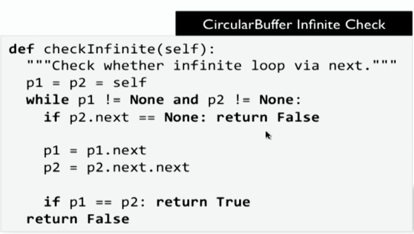

# Oreilly Data Structures in Python Course

By God.

This readme file is written by Mohammad Reza Dehghani Tafti.

Contact me at dehghani735@gmail.com

Start Date: 13990113

---

## 2. Built-in Data Types

### List

- Start empty
- Append values, remove values, search for values
- (Optional) sort
- Process all values in order

### Stack

Process collection of values in LIFO

- Push values onto stack
- Pop and retrieve most recently added value
- Check if empty

### Queue

Process collection of values in FIFO

- Append value to tail of queue
- pop value from head of queue
- Check if empty

### Python Built-in Data Types

- List
  - l = [11, 51, 9]
  - Homogeneous structures with order

<!--   aList = [1,2,4]\
aList.append(8)
len(aList)
aList.sort() 
-->

- Tuple
  - t = (11, ‘MA’, 9)
  - Immutable Heterogeneous structures

**Note:** These two above are _sequence types_

- Dictionary
  - d = {11: 99}
  - Map hashable keys to arbitrary values
  - Associative look-up
- Set
  - s = {11}
  - Unordered collection of unique elements

**Note:** Difference between _Dictionary_ and _Set_ in python is that _Dictionary_ has : but _Set_ has not.

**Note:** Since _Dictionary_ and _Set_ are unordered, when we print them, they might be printed in differenct order from what they were defined.

**Note:** If sequence is important to us, we should use _List_ or _Tuple_.

- Deque (Double Ended Queue)
  - q = deque([11])
  - Efficient append/remove on either end
  - Perhaps least well-known of built-in types
  - `from collections import deque`

These are types used in this course.

- Aggregate structures for collections
- Common behaviours, some differences

Designed for consistency of interface

- Many methods have same names

## 3. API Operations

[top](#orielly-data-structures-in-python-course)

Python tries to use the same operation name among different data types.

|  | Size | Add | Remove | Contains |
| --- | --- | --- | --- | --- |
| List l | len(l) | insert, append | del, pop, remove | in, index |
| Tuple t | len(t) | - | - | in |
| Dictionary d | len(d) | d[k] = v | del, pop | in |
| Set s | len(s) | add | remove | in |
| Deque q | len(q) | append | del, pop | in |

## 4. Analysis Techniques

[top](#orielly-data-structures-in-python-course)

It consists of time analysis and space analysis

timeit function -> import timeit
It is used to get time of any code.

Asymptotic growth

A problem: fine if a List has duplicate values:
2 solutions:

- Using set; but it uses space -> O(n)
- Using two for loops; it uses no extra space; but O(n**2)

## 5. Design Principles for Data Structures

[top](#orielly-data-structures-in-python-course)

### Buil-in Type Complexity

|  | Add | Remove | Contains |
| --- | --- | --- | --- |
| List l | insert: O(n), append: O(1) | O(n) | O(n) |
| Tuple t  | - | - | O(n) |
| Dictionary d | O(1) -> O(n) | O(1) -> O(n) | O(1) -> O(n) |
| Set s | O(1) -> O(n) | O(1) -> O(n) | O(1) -> O(n) |
| Deque q | O(1) | pop: O(1), remove: O(n) | O(n) |

- Amortized Constant O(1)
  - Means that given sufficient number of requests, the average performance time is constant
  - Occasionally one operation could require O(n) in the worst case
  - Most frequently occurs with hashing whose performance depends on statistical estimates.

## 6. Using lists to Implement Stack

[top](#orielly-data-structures-in-python-course)

Lists are ubiquitous: Python lists are everywhere

- The first (only?) aggregate structure used
  - Continious arrays in memory
  - append, insert,  index, remove, del
  - Brackets [...]
- Underlying Array Implementation
  - Continious block of memory
  - Potential to waste resources as size grows
    - Every element of list is a reference
  - Operations can become quite expensive
    - del myList[0] is an O(n) operation
    - Must move remaining n-1 elements
  - Use wisely to ensure efficient performance

Example: Use List as Stack

- Stack is abstract data type
  - push(v)
  - pop()
  - isEmpty()
  - With information hiding, we implement it and no one from outside could determine which structure is used. Only behaviour is exposed (API)

## 7. Principle - Separate Structure from Function

[top](#orielly-data-structures-in-python-course)

- Tuple are read-only structures
  - Useful when you want to provide information that cannot be changed
  - Most extreme case since structure has no function
  - Supports iteration, indexing, contains

## 8. Example - Circular Buffer

[top](#orielly-data-structures-in-python-course)

Problem: Process time data series

- Given limitless series of data events
  - **Volume**: much too large to store in memory
  - **Time**: High-speed arrival of data
- Example:
  - Stock or currency prices
  - Sensor data

In data series, one important measurement is called **Moving Average**

- Compute Moving Average Efficiently in a window
  - Given series of data events over time
    - Process fixed number of values in **slicing window**
    - Moving average defined over values in window


- Naive Python Solution
  - Use window list to store values in window
    - Append new value to end of list
    - Remove 0th element if length exceeds window size
  
    - ```python
      def add(window, value, size):
        if len(window) == size:
          del window[0]
        window.append(value)
      ```

    - del window[0]: This is **Significantly inefficient**
    - Never forget that a Python **List** is an array
      - Remove 0th element must copy n-1 elements.
      - Thus del window[0] is an O(n) operation
      - Eliminate this cost with **CircularBuffer**

- Circular Buffer Solution
  - Use Python list as fixed-size buffer
    - Maintain illusion that is wraps around to form a (clockwise) circle
    - Queue behaviour
      - Add to the end
      - Remove from the front
      - These operations become O(1) always
    - Adding element overrides oldest element in buffer
      - Maintain (low, high) indices within buffer 

- Circular Buffer Data Type Definition
  - fixed-size storage
  - Seperate indices and count
    - When not empty, low is index of first element
    - When not empty, high is index of **next location** to use 
    - **Note**: The None keyword is used to define a null value, or no value at all. It is of type NoneType. All variables that are assigned None point to the same object. New instances of None are not created.
    - **Note**: _pass_ statement in Python; is like nop. It Creates a placeholder for future code.
  
**Note**: **Yield**: easy to write and efficient to execute. return a value one at a time. To find out more, [click here](https://stackoverflow.com/questions/231767/what-does-the-yield-keyword-do).

**Note**: **Generator**: Generators are iterators, a kind of iterable you can only iterate over once. Generators do not store all the values in memory, they generate the values on the fly:

```python
>>> mygenerator = (x*x for x in range(3))
>>> for i in mygenerator:
...    print(i)
0
1
4
```

**Note**: In the code above, mygenerator is of type _generator_ class

yield is a keyword that is used like return, except the function will return a generator.

- Circular Buffer Data Type Definition
  - Read-only operations
    - isEmpty, isFull, `__len__` -> O(1)
  - Modifying
    - add(v)  -> O(1)
    - remove()  -> O(1)
  - Iterator used by in   -> O(n)

## 9. Project - Moving Average _ Stdev

[top](#orielly-data-structures-in-python-course)

### Python lists, Primary Weakness

- Avoid functions that return **list** objects whose values are simply iterated.
  - Consider **generator**
  - fibonacci with list

### Python Generator, Alternative to Constructing list objects

- Generator avoids contstructing lists
  - when can compute the elements using computation
  - fibonacci with Generator (go to Code)

### Conclusion

- Many Python programmers rely solely on lists
  - Suitable for prototype and investigations
  - Make sure you structure data effectively for efficient code
- Primary weakness is contiguous memory storage
  - Highly optimised in CPyton but we can do better

## 10. Linked Lists

### Pointer-based Data Structures

- Contiguous memory such as an array have known weaknesses
  - Removing one value forces move of others
  - Inserting one value does the same
- Linked Lists were common solution in early Computer languages, such as C and Perl
  - Worth reviewing for basic skills
- LinkedNode object
  - Knows value
  - Has Reference to subsequent LinkedNode object
  - If there is no subsequent one, next is None
- Object reference was formerly called **pointer**


### Pointer-based Data Structures: List

- LinkedList object manages structure of aggregate
  - Knows first LinkedNode called head
- Example: In final LinkedNode, next is None 

### Pointer-based Data Structures: Operations

- Efficient Operations: Both O(1)
  - Remove first value (pop in python) from LinkedList
  - Prepared new value to LinkedList
- Other Operations
  - Remove target value  -> O(n)

## 11. Queues

### Pointer-Based Queues Using Linked Lists

- Queue requires efficient O(1) operations
  - Append to the end(tail)
  - Remove from the front (head)
- Queue stores tail node as well as head node 

### Pointer-Based Queues Summary

- You don't need to (re)implement Queue
  - Use collections.deque instead
  - 5x faster on sample behavior
  - Implemented in C 

## 12. Project - Detect Cycles in Linked List

### Pointer-Based Interview Question

- How can you detect a cycle or infinite linked list?
- Pointer-base Solution 

## 13. Prefix Tree

### Pointer-based Alternative Example: Prefix Tree

- A **Prefix Tree** is a data structure that compactly stores strings
  - Boxes that terminate words are shaded yellow
- Use **dict** as alternative to pointers
  - Observe regularity of structure
  - Each box is a **dict** object 

- Python dict allows associative storage d[k] = v
  - Store nested dict objects as values
  - Each dict refers up to 26 other dict objects
  - To record word, associate special WordKey in corresponding dict
- Set semantics enforced
  - add and remove return Boolean values

### Pointer-based Structure Summary

- Provides structural basis for recursive data structures
- Code will not compete with built-in types
- Python Garbage collection reclaims unused nodes

